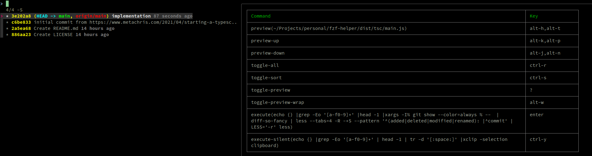

# fzf-helper

fzf helper is a small nodejs project that I use on my personal machine to show a preview in fzf listing the bindings of the current fzf invocation

Use the following snippet in you shell init files.

```
export FZF_DEFAULT_OPTS="--bind='alt-h:preview(/path/to/fzf-helper/dist/tsc/main.js)'"
```

It shows up like this


